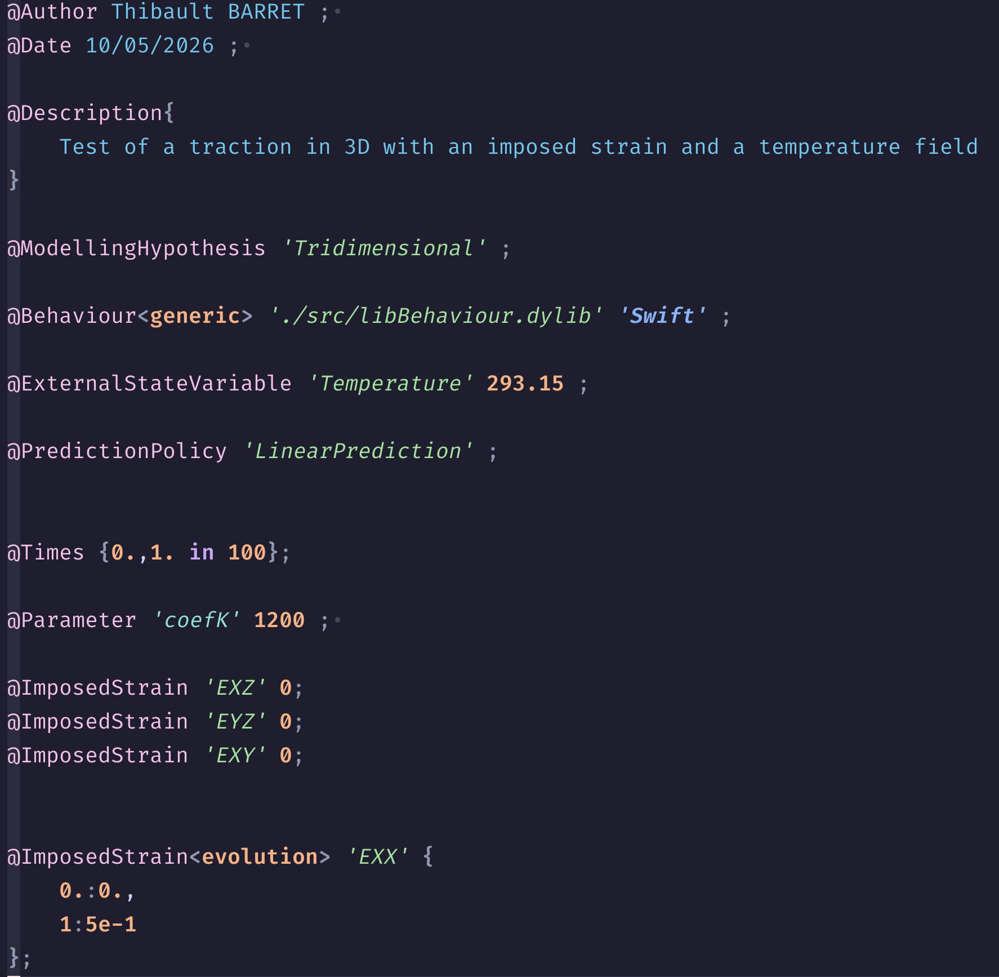

Ce projet a pour but de dotter `MFront` et `MTest` d'une grammaire Tree-sitter,
permettant ainsi une meilleure prise en charge de ces langages dans les éditeurs
de code compatibles avec Tree-sitter (comme Neovim, Atom, VsCode etc.).
Les inclusions de `C++` sont traités par injections, ce qui permet de bénéficier
de la coloration syntaxique et de l'analyse structurelle du code `C++` dans les fichiers `MFront` et `MTest`.

# Avancement du projet

## MFront

Pour le moment, les mots clés des `@DSL` suivant sont supportés :

- **MaterialProperty**
- **MaterialLaw**
- **Model**

Les `@DSL` suivants sont en cours de développement :

- **IsotropicPlasticMisesFlow**
- **Implicit**

## MTest

L'ensemble des mots clés de `MTest` est supporté.

Dans l'éditeur de code `Neovim`, elle permet d'obtenir la coloration syntaxique suivante :

# Installation du parser

## Neovim

### Compilation du parser
